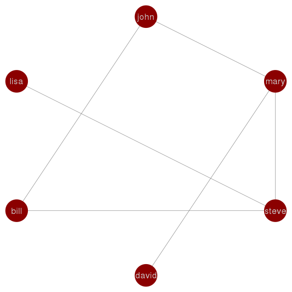

Data Mining 1 MapReduce in Python
================

Python MapReduce Framework
--------------------------

You will be provided with a python library called MapReduce.py that implements the MapReduce programming model. The framework faithfully implements the MapReduce programming model, but it executes entirely on a single machine -- it does not involve parallel computation. Here is the word count example discussed in class implemented as a MapReduce program using the framework:

    # Part 1
    mr = MapReduce.MapReduce() 

    # Part 2
    def mapper(record):
     # key: document identifier
     # value: document content
     key = record[0]
     value = record[1]
     words = value.split()
     for w in words:
     mr.emit_intermediate(w, 1)
     
    # Part 3
    def reducer(key, list_of_values):
     # key: word
     # value: list of occurrence counts
     total = 0
     for v in list_of_values:
     total += v
     mr.emit((key, total))
     
    # Part 4
    inputdata = open(sys.argv[1])
    mr.execute(inputdata, mapper, reducer) 

In **Part 1**, we create a MapReduce object that is used to pass data between the map function and the reduce function.

In **Part 2**, the mapper function tokenizes each document and emits a set of key-value pairs. The key is a word formatted as a string and the value is the integer 1 to indicate an occurrence of the word.

In **Part 3**, the reducer function sums up the list of occurrence counts and emits a count for a word. Since the mapper function emits the integer 1 for each word, each element in the list\_of\_values is the integer 1. The list of occurrence counts is summed and a (word, total) tuple is emitted where word is a string and total is an integer.

In **Part 4**, the code loads the JSON file and executes the MapReduce program which prints the result to stdout.

Submission Details
------------------

For each problem, submit one or more Python scripts, with each corresponding to a phase of MapReduce program you are writing. The output from each phase is to stdout, which can be redirected to a file to be given as the input for the next phase.

If your program has multiple phases, name the script for the first phase as phase1, the second phase as phase2, etc. Please also add your name to the script name to facility our grading.

So the submission by “John Smith” for the problem 1 would be “john\_smith\_<problem 1>.py” if the program has a single phase; or “john\_smith\_<problem_1>*phase1.py” and “john\_smith*<problem_1>\_phase2.py” if two phases. Note that substitute <problem_1> with the specific problem name as given below.

When testing, make sure MapReduce.py is in the same directory as your solution script.

To allow you to test your programs, sample data and solution will be provided.

Please solve the problems by simply replacing the mapper and reducer functions in wordcount.py, to produce your code for (one phase) of your MapReduce program. Please follow the output formats as given in the sample solution.

Problem 1 (Social network: finding connections)
-----------------------------------------------

In this problem, consider a social graph where nodes are people and edges represent their friendship. You are to write a MapReduce program to find indirect connection between two people.

There is an indirect connection between two persons X and Y if X and Y are connected via a third person Z. In other words, there exist edges (X, Z) and (Z, Y). For example, there is an indirect connection between “john” and “david” since both are connected to “mary”. Note that in this problem, we assume that X and Y may also be directly connected (i.e., there is an edge between X and Y) even though there may exist some indirect connections between X and Y.

For every indirect connection, say X and Y connected via Z as described above, output: \[X, Y, Z\]. Note that there may be multiple indirect connections between X and Y, e.g., \[X, Y, W\]. You need to output all connections via a different third person, e.g., Z and W. But you should only output once for every unique connection. That is, either \[X, Y, Z\] or \[Y, X, Z\] but not both.

The input will be provided as a JSON document where each line represents an edge on the graph. For example,

Problem 2 (Descriptive statistics: variance)
--------------------------------------------

In this problem, you are provided with a large number of integers, pre-divided into chunks, with each chunk stored as a line (an JSON array) in the input file (see below). Your task is to compute the variance of the integers using MapReduce. Recall that the variance can be computed as the average of X2 minus the square of the average of X, as show below.

Here is the sample input:

